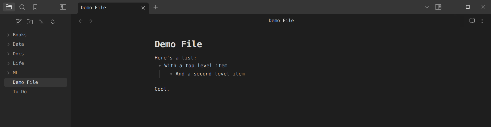
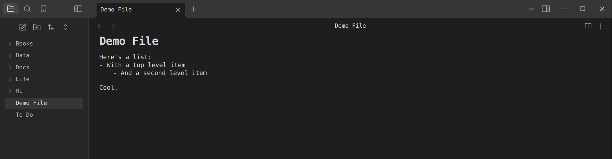

Obsidian CSS snippets to make the UI denser and feel a bit more like vim/vscode.

Along with these theme tweaks, I use:
- UI scale 83%
- DejaVu Sans Mono size 14
- Show ribbon off
- Readable line length

Before Tweaks:

After Tweaks:

